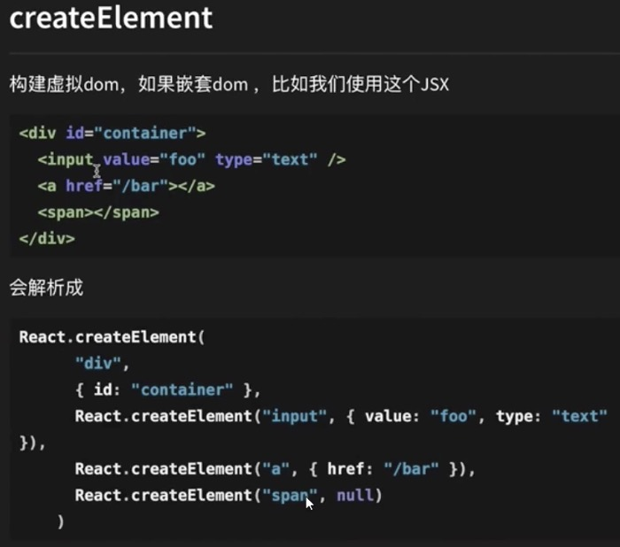
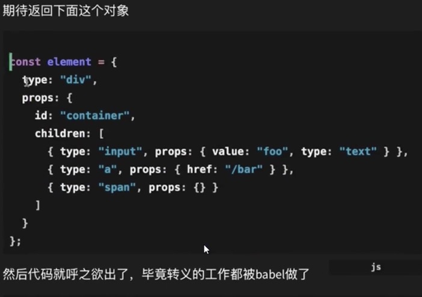
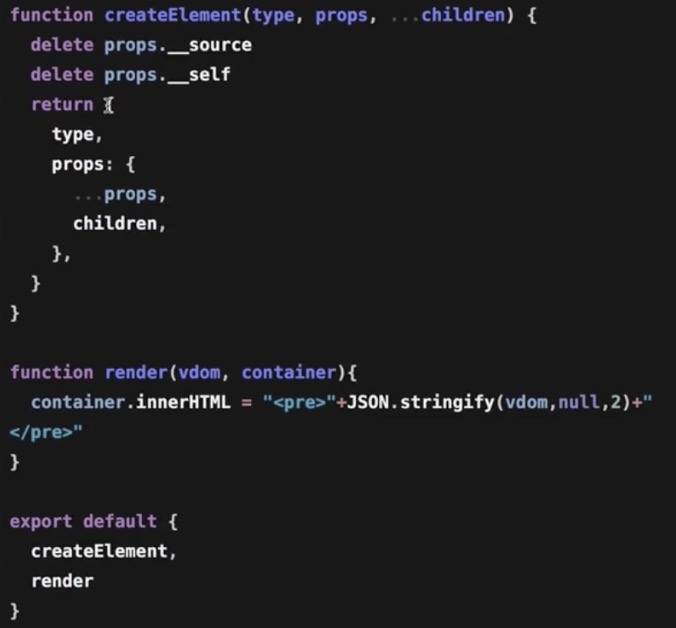
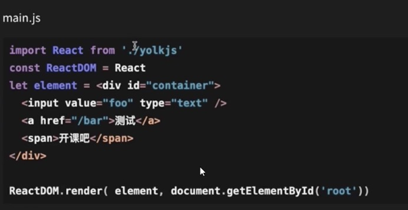

- jsx 其实是 babel 转义成 React.createElement 来执行，用来构建虚拟 dom
- 对于一个 dom 有非常多多属性，dom 操作一直是前端性能的杀手，我们用 js 对象来描述我们 dom，createElement 返回的就是虚拟 dom

#### requestIdleCallback

- Q：注意上面的 render，一旦开始就开始递归本身这个没啥问题，但是如果应用变得庞大就会卡顿，后面状态修改 diff 也是一样整个 vdom 对象变大后，diff 的过程也有会递归过多导致卡顿？

* A：浏览器有哥 API requestIdleCallback 可以利用浏览器的业余时间，我们可以把任务分成一个个小的任务，然后利用浏览器空闲时间来 diff，如果当前又来任务，比如用户点击或者动画，会先执行然后空闲后再回去把 requestIdleCallback 没完成的任务完成。（类比火车，比如车厢干活休息我们记住上次干到那节车厢，下次回来继续干活）。

- fibers 我们有了调度逻辑，之前的vdom结构是一个树形结构，它的diff过程是没法中断的，为了管理我们vdom树之间关系，需要我们把树形结构的内部关系改成链表（方便终止）之前只是children作为一个数组递归遍历，现在父》子，子》父，子》兄，都有关系。整个任务从render开始，然后每次只遍历一个小单元，一旦被打断就会执行优先级高的任务（用户交互/动画）回来后，有余回来的元素知道父子兄元素，很容易恢复遍历状态。

- 提交commit：我们给dom添加节点的时候，如果渲染的过程中被打断，ui渲染会变得很奇怪，所以我们应该把dom操作独立出来，我们用一个全局变量来存储正在工作fiber根节点（workInprogress tree）
